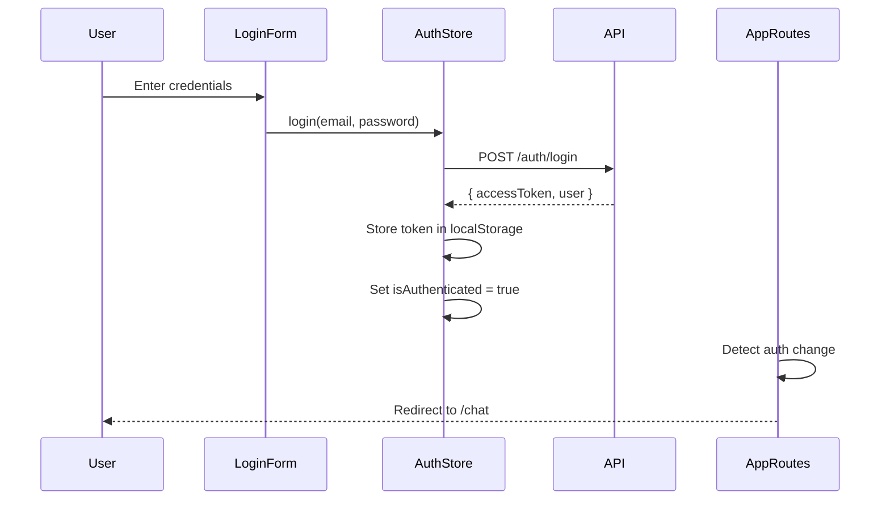
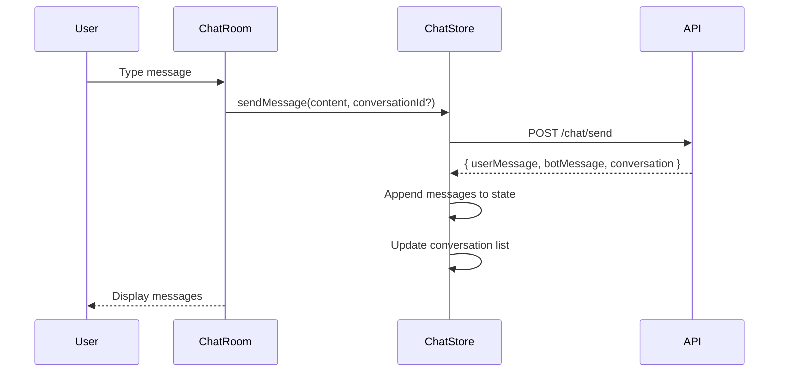

# AI Sales Chat - Frontend Documentation

> A modern React + TypeScript chat application with AI-powered sales assistance

## 📋 Table of Contents

- [Overview](#overview)
- [Tech Stack](#tech-stack)
- [Project Structure](#project-structure)
- [Getting Started](#getting-started)
- [Core Features](#core-features)
- [Architecture](#architecture)
- [Components](#components)
- [State Management](#state-management)
- [API Integration](#api-integration)
- [Interfaces](#interfaces)
- [Development Guide](#development-guide)

---

## Overview

This frontend application provides a real-time chat interface for users to interact with an AI sales assistant. Built with React and TypeScript, it features authentication, conversation management, and a responsive UI designed with Material-UI.

### Key Features

- 🔐 **JWT Authentication** with automatic token refresh
- 💬 **Real-time Chat** with message history
- 📂 **Conversation Management** (create, edit, delete)
- 🎨 **Dark Mode Support**
- 📱 **Responsive Design** (mobile & desktop)
- ⚡ **Optimistic UI Updates**
- 🔄 **Auto-scroll** to latest messages

---

## Tech Stack

| Technology | Purpose |
|------------|---------|
| React 19 | UI library |
| TypeScript | Type safety |
| Vite | Build tool & dev server |
| Material-UI (MUI) | Component library |
| Zustand | State management |
| React Hook Form | Form validation |
| React Router | Client-side routing |
| Axios | HTTP client |
| Tailwind CSS | Utility-first styling |

---

## Project Structure

```
src/
├── components/              # Shared components
│   └── ProtectedRoute.tsx  # Route guard
├── features/               # Feature-based modules
│   ├── auth/              # Authentication
│   │   ├── components/    # Login/Register forms
│   │   ├── pages/         # Auth pages
│   │   ├── services/      # Auth API calls
│   │   └── store/         # Auth state (Zustand)
│   └── chat/              # Chat functionality
│       ├── components/    # Chat UI components
│       ├── pages/         # Chat page
│       ├── services/      # Chat API calls
│       └── store/         # Chat state (Zustand)
├── interfaces/            # TypeScript interfaces
│   ├── api.interface.ts   # Generic API response
│   ├── auth.interface.ts  # Auth types
│   └── chat.interface.ts  # Chat types
├── lib/                   # Configuration & utilities
│   └── axios.ts          # Axios setup with interceptors
├── routes/               # Route definitions
│   └── AppRoutes.tsx     # Main routing logic
├── App.tsx               # Root component
└── main.tsx              # Application entry point
```

---

## Getting Started

### Prerequisites

- Node.js 18+
- npm or yarn

### Installation

```bash
# Clone repository
git clone <repository-url>
cd ai-sales-chat-frontend

# Install dependencies
npm install

# Configure environment
cp .env.example .env
# Edit .env with your API URL
```

### Environment Variables

```env
VITE_API_URL=http://localhost:3000
```

### Development

```bash
# Start dev server (http://localhost:5173)
npm run dev

# Build for production
npm run build

# Preview production build
npm run preview

# Lint code
npm run lint
```

---

## Core Features

### Authentication Flow



### Chat Flow



---

## Architecture

### State Management Strategy

The application uses **Zustand** for lightweight, React-friendly state management:

- **Auth Store**: User session, authentication status
- **Chat Store**: Messages, conversations, loading states

### API Communication Pattern

All API calls follow a consistent pattern:

1. **Service Layer** (`services/`) - Handles HTTP requests
2. **Store Layer** (`store/`) - Manages state and orchestrates service calls
3. **Component Layer** - Consumes state via hooks

---

## Components

### Shared Components

#### ProtectedRoute

Guards routes requiring authentication.

```typescript
interface ProtectedRouteProps {
  children: React.ReactNode;
}
```

**Usage:**
```tsx
<Route path="/chat" element={
  <ProtectedRoute>
    <ChatPage />
  </ProtectedRoute>
} />
```

---

### Auth Components

#### LoginForm

Handles user login with validation.

**Fields:**
- `email` (required, email pattern)
- `password` (required, min 6 chars)

**Features:**
- Form validation with `react-hook-form`
- Error display
- Loading state

#### RegisterForm

User registration with password confirmation.

**Fields:**
- `name` (required, min 2 chars)
- `email` (required, email pattern)
- `password` (required, min 6 chars)
- `confirmPassword` (must match password)

**Features:**
- Automatic login after registration
- Password matching validation

---

### Chat Components

#### ChatRoom

Main chat container coordinating message display and input.

```typescript
const ChatRoom = () => {
  const { messages, isLoading, sendMessage, currentConversation } = useChatStore();
  
  const handleSend = (text: string) => 
    sendMessage(text, currentConversation?.id);

  return (
    <Paper>
      <MessageList messages={messages} />
      <MessageInput onSend={handleSend} disabled={isLoading} />
    </Paper>
  );
};
```

#### MessageList

Displays conversation messages with auto-scroll.

**Features:**
- User/bot message distinction
- Timestamps
- Auto-scroll to latest
- Dark mode support

#### MessageInput

Text input with send button.

**Props:**
```typescript
interface MessageInputProps {
  onSend: (message: string) => void;
  disabled?: boolean;
}
```

#### ConversationList

Sidebar showing all user conversations.

**Features:**
- Create new conversation
- Edit conversation title (dialog)
- Delete conversation
- Select active conversation

#### Sidebar

Responsive drawer containing `ConversationList`.

**Behavior:**
- **Desktop**: Permanent drawer
- **Mobile**: Temporary drawer (hamburger menu)

---

## State Management

### Auth Store (`authStore.ts`)

```typescript
interface AuthState {
  user: User | null;
  token: string | null;
  isAuthenticated: boolean;
  
  login: (email: string, password: string) => Promise<void>;
  register: (data: RegisterRequest) => Promise<void>;
  logout: () => void;
  checkAuth: () => Promise<void>;
  setUser: (user: User) => void;
}
```

**Key Methods:**

- `login()` - Authenticates user, stores token
- `register()` - Creates account, auto-logs in
- `checkAuth()` - Validates existing token on app load
- `logout()` - Clears session

### Chat Store (`chatStore.ts`)

```typescript
interface ChatState {
  conversations: Conversation[];
  currentConversation: Conversation | null;
  messages: Message[];
  isLoading: boolean;
  error: string | null;
  
  sendMessage: (message: string, conversationId?: string) => Promise<void>;
  loadConversationHistory: (conversationId: string) => Promise<void>;
  loadConversations: () => Promise<void>;
  createNewConversation: () => void;
  setCurrentConversation: (conversation: Conversation | null) => void;
  deleteConversation: (conversationId: string) => Promise<void>;
  updateConversationTitle: (conversationId: string, title: string) => Promise<void>;
}
```

**Key Methods:**

- `sendMessage()` - Sends user message, receives bot response
- `loadConversations()` - Fetches user's conversation list
- `loadConversationHistory()` - Loads messages for selected conversation
- `deleteConversation()` - Removes conversation
- `updateConversationTitle()` - Renames conversation

---

## API Integration

### Axios Configuration (`lib/axios.ts`)

Custom Axios instance with:

- **Base URL** from environment variable
- **Request Interceptor**: Attaches JWT token
- **Response Interceptor**: Unwraps `ApiResponse<T>` wrapper
- **Error Handling**: Auto-logout on 401

```typescript
const instance = axios.create({
  baseURL: import.meta.env.VITE_API_URL,
  timeout: 10000,
  headers: { "Content-Type": "application/json" }
});

// Attach JWT token
instance.interceptors.request.use(config => {
  const token = localStorage.getItem("access_token");
  if (token) config.headers.Authorization = `Bearer ${token}`;
  return config;
});

// Handle 401 errors
instance.interceptors.response.use(
  response => response.data,
  error => {
    if (error.response?.status === 401 && localStorage.getItem("access_token")) {
      localStorage.removeItem("access_token");
      window.location.href = "/login";
    }
    return Promise.reject(error);
  }
);
```

### Service Pattern

All API calls are centralized in service files:

**Auth Service** (`authService.ts`):
```typescript
export const authService = {
  async login(credentials: LoginRequest): Promise<LoginResponse> {
    const response = await axiosInstance.post<LoginResponse>("/auth/login", credentials);
    return response.data;
  },
  
  async register(data: RegisterRequest): Promise<RegisterResponse> {
    const response = await axiosInstance.post<RegisterResponse>("/auth/register", data);
    return response.data;
  },
  
  async getUser(): Promise<MeResponse> {
    const response = await axiosInstance.get<MeResponse>("/auth/me");
    return response.data;
  }
};
```

**Chat Service** (`chatService.ts`):
```typescript
export const chatService = {
  async sendMessage(data: SendMessageRequest): Promise<SendMessageResponse> {
    const response = await axiosInstance.post<SendMessageResponse>('/chat/send', data);
    return response.data;
  },
  
  async getHistory(conversationId: string) {
    const response = await axiosInstance.get(`/chat/history/${conversationId}`);
    return response.data;
  },
  
  async getConversations(): Promise<Conversation[]> {
    const response = await axiosInstance.get<Conversation[]>('/chat/conversations');
    return response.data;
  },
  
  async deleteConversation(conversationId: string): Promise<void> {
    await axiosInstance.delete(`/chat/conversations/${conversationId}`);
  },
  
  async updateTitle(conversationId: string, title: string): Promise<void> {
    await axiosInstance.patch(`/chat/conversations/${conversationId}/title`, { title });
  }
};
```

---

## Interfaces

### API Response Wrapper

All backend responses follow this structure:

```typescript
export interface ApiResponse<T = any> {
  success: boolean;
  message: string;
  timestamp: Date;
  path: string;
  data: T;
}
```

### Auth Interfaces

```typescript
export interface User {
  email: string;
  name: string;
}

export interface LoginRequest {
  email: string;
  password: string;
}

export interface RegisterRequest {
  name: string;
  email: string;
  password: string;
}

export interface LoginResponse {
  accessToken: string;
  refreshToken: string;
  user: User;
}
```

### Chat Interfaces

```typescript
export interface Message {
  id: string;
  content: string;
  sender: "user" | "bot";
  conversationId: string;
  createdAt: string;
}

export interface Conversation {
  id: string;
  title: string;
  createdAt: string;
  updatedAt: string;
}

export interface SendMessageRequest {
  conversationId?: string;
  content: string;
}

export interface SendMessageResponse {
  conversation: {
    id: string;
    title: string;
  };
  userMessage: Message;
  botMessage: Message;
}
```

---

## Development Guide

### Code Style

- **TypeScript**: Strict mode enabled
- **Linting**: ESLint with React plugins
- **Formatting**: Follow existing conventions

### Component Guidelines

1. **Use functional components** with hooks
2. **Extract reusable logic** into custom hooks
3. **Keep components small** (<200 lines)
4. **Collocate related files** in feature folders

### State Management Best Practices

1. **Keep stores focused** - one store per domain
2. **Derive state when possible** - avoid duplication
3. **Handle errors gracefully** - always catch in async actions
4. **Use TypeScript** - leverage type safety

### Performance Tips

- Use React DevTools Profiler
- Memoize expensive computations
- Lazy load routes if needed
- Optimize re-renders with proper dependencies

---

## Troubleshooting

### Common Issues

**Issue**: Token not persisting after login  
**Solution**: Check `localStorage` implementation and axios interceptors

**Issue**: Chat messages not updating  
**Solution**: Verify Zustand store subscription in components

**Issue**: 401 errors on protected routes  
**Solution**: Ensure token is valid and interceptor is attaching it

**Issue**: Sidebar not updating after creating conversation  
**Solution**: Check that `loadConversations()` is called after `sendMessage()`

---

## Performance Considerations

- **Code splitting**: Routes are not currently split but can be with `React.lazy()`
- **Message virtualization**: Consider for conversations with 1000+ messages
- **Debounce input**: Already handled by form submission
- **Optimistic updates**: Messages appear instantly before API confirmation

---

## Security Notes

- **JWT stored in localStorage**: Consider httpOnly cookies for production
- **CORS configuration**: Ensure backend allows frontend origin
- **Input sanitization**: Backend should validate all inputs
- **XSS protection**: React escapes by default, but be careful with `dangerouslySetInnerHTML`

---

## Future Enhancements

- [ ] Message editing/deletion
- [ ] File/image sharing
- [ ] Typing indicators
- [ ] Read receipts
- [ ] Search within conversations
- [ ] Export conversation history
- [ ] Markdown support in messages
- [ ] Voice input

---

## License

[Your License Here]

## Contributors

[Your Team Here]

---

**Last Updated**: December 2024